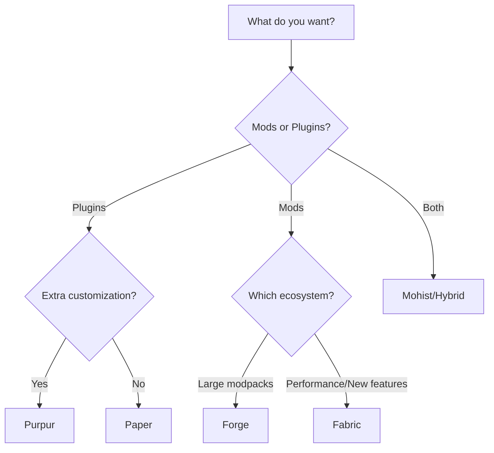

# Choosing Your Minecraft Server Software

One of the first decisions you'll make when setting up a Minecraft server is choosing the server software. This guide covers all the popular options and helps you pick the right one for your needs.

## Server Software Comparison

| Software | Type | Plugin Support | Mod Support | Performance |
|----------|------|----------------|-------------|-------------|
| Vanilla | Official | ❌ | ❌ | Baseline |
| Paper | Bukkit Fork | ✅ Bukkit/Spigot | ❌ | ⭐⭐⭐⭐⭐ |
| Purpur | Paper Fork | ✅ Bukkit/Spigot | ❌ | ⭐⭐⭐⭐⭐ |
| Forge | Modded | ❌ | ✅ Forge | ⭐⭐⭐ |
| Fabric | Modded | ❌ | ✅ Fabric | ⭐⭐⭐⭐ |
| Mohist | Hybrid | ✅ Bukkit | ✅ Forge | ⭐⭐⭐ |

## Vanilla

The official Minecraft server software from Mojang.

**Pros:**
- Official and always up-to-date
- Guaranteed compatibility
- Simple setup

**Cons:**
- No plugin or mod support
- Lower performance
- Limited customization

**Best for:** Pure vanilla experience, technical Minecraft servers

## Paper (Recommended for Plugins)

The most popular server software for plugin-based servers.

**Pros:**
- Excellent performance optimization
- Bukkit/Spigot plugin compatibility
- Active development and community
- Many built-in optimizations
- Asynchronous chunk loading

**Cons:**
- Some vanilla mechanics may be altered
- No mod support

**Best for:** Most servers, especially those wanting plugins

### Installing Paper

1. In your game panel, go to **Settings** > **Server Software**
2. Select **Paper** from the dropdown
3. Choose your Minecraft version
4. Restart your server

## Purpur

A Paper fork with additional features and customization options.

**Pros:**
- All Paper benefits
- Extra gameplay tweaks
- More configuration options
- Rideable mobs
- AFK system built-in

**Cons:**
- Slightly behind Paper updates
- More complex configuration

**Best for:** Servers wanting maximum customization

### Notable Purpur Features

```yaml
# Example purpur.yml customizations
purpur:
  ridable:
    bees: true
    dolphins: true
  gameplay-mechanics:
    player:
      idle-timeout:
        kick-if-idle: false
```

## Forge

The go-to choice for modded Minecraft with extensive mod libraries.

**Pros:**
- Massive mod library
- Well-established ecosystem
- Most popular for modpacks

**Cons:**
- Higher resource usage
- No native Bukkit plugin support
- Slower updates for new MC versions

**Best for:** Modded servers, modpacks (FTB, ATM, etc.)

### Installing Forge

1. Select **Forge** as server software
2. Choose Minecraft and Forge versions
3. Upload your mods to `/mods/` folder
4. Restart server

> ⚠️ **Important:** All players must have matching mods installed!

## Fabric

A lightweight, modern modding platform.

**Pros:**
- Lightweight and fast
- Quick updates for new MC versions
- Growing mod library
- Good for performance mods

**Cons:**
- Smaller mod library than Forge
- Mods not cross-compatible with Forge

**Best for:** Lightweight modded servers, performance-focused setups

### Popular Fabric Mods

- **Lithium** - Server optimization
- **Starlight** - Lighting engine rewrite
- **FerriteCore** - Memory optimization
- **Carpet** - Technical features and fixes

## Mohist & Hybrids

Hybrid servers that support both mods AND plugins.

**Pros:**
- Best of both worlds
- Flexibility for complex setups

**Cons:**
- Potential compatibility issues
- More complex troubleshooting
- May lag behind updates

**Best for:** Advanced users wanting both mods and plugins

> ⚠️ **Warning:** Hybrid servers can have stability issues. Test thoroughly!

## Quick Decision Guide



### In Summary

- **Just starting?** → Paper
- **Want plugins?** → Paper or Purpur
- **Playing modpacks?** → Forge
- **Want modern, light mods?** → Fabric
- **Need both?** → Mohist (advanced users)

## Version Recommendations

| Use Case | Software | Version |
|----------|----------|---------|
| Public SMP | Paper | Latest stable |
| Private friends | Paper/Purpur | Latest stable |
| Modpack server | Forge | Modpack specified |
| Technical server | Fabric | Latest |
| Development | Paper | Latest snapshot (optional) |

## Performance Expectations

With a NodeByte plan, here's what you can expect:

| Plan | Software | Expected Players |
|------|----------|------------------|
| 4GB | Paper | 20-30 players |
| 4GB | Forge (light) | 5-10 players |
| 8GB | Paper | 40-60 players |
| 8GB | Forge (modpack) | 15-25 players |

## Next Steps

After choosing your server software:

1. [Configure your server.properties](/kb/minecraft/server-properties)
2. [Install plugins](/kb/minecraft/installing-plugins) (if using Paper/Purpur)
3. [Optimize performance](/kb/minecraft/optimization)

---

Need help deciding? Ask in our [Discord](https://discord.gg/wN58bTzzpW)!
